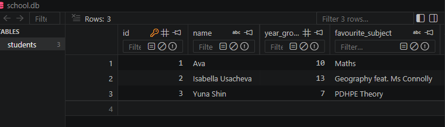

# Lesson 02 Evidence Pro-Forma

## Commit evidence (minimum 2)
- Commit 1 hash + message:
.png)
- Commit 2 hash + message:
.png)
- Optional Commit 3 hash + message:

## Run evidence
- Command run: ```python Python-Files/lesson2_create_table.py```
- Terminal output pasted below: 
**No output in terminal**


## SQL/Python changes I made
- Added a new column called "favourite_subject"
- Gave students a value for favourite_subject

## Error and fix
- Error I hit: **I hit no errors**
- How I fixed it: 

## Understanding check (answer in your own words)
1. Why do we use `commit()`?
We use commit() to save all changes made by statements from the cursor such as INSERT/DELETE/CREATE.
2. What does `PRIMARY KEY` mean?'
A PRIMARY KEY creates a constraint on the specified column so each record has a unique index
3. Why is `IF NOT EXISTS` useful when creating tables?
It checks if the database already exists before creating a new one, which helps prevent creation of duplicate databases.

## Quality checklist
- [✔] Script runs without unhandled errors
- [✔] I included at least 2 lesson commits
- [✔] I showed inserts and saved changes
- [✔] I answered all questions in my own words
