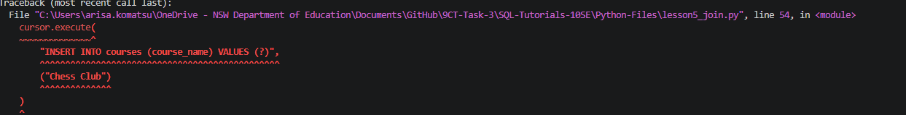

# Lesson 05 Evidence Pro-Forma

## Commit evidence (minimum 2)
- Commit 1 hash + message:
- Commit 2 hash + message:
- Optional Commit 3 hash + message:

## Run evidence
- Command run: python Python-Files/lesson5_join.py
- Terminal output pasted below:
```
('Ava', 'Science Club')
('Leo', 'Math Club')
```

## Typed-work confirmation
- Briefly describe how you typed your changes step-by-step (including at least one pause to run and check output):
I added another cursor.execute to insert two new courses "Chess Club" and "Yuna Club" and assigned it to the existing student ids. I then paused to execute and it worked so yeah.

## Prediction before run
- JOIN query version: 
```
cursor.execute("""
    SELECT students.name, courses.course_name
    FROM students
    JOIN courses ON students.id = courses.student_id
""")
```
- My prediction (student-course pairs): Leo wil lbe assigned the value Math Team and Ava will be assigned the value Science Club
- What actually happened: The same thing happened

## SQL/Python changes I made
- Change 1: Made cursor.execute("INSERT INTO courses blah blah") for Chess Club and assigned to leo
- Change 2: Made cursor.execute("INSERT INTO courses blah blah") for Yuna Club and assigned to ava
- Why these changes were mine (not just starter code): I used my own brain and wrote the changes using what I learnt without copying.

## Error and fix
- Error I hit:

- How I fixed it:
Assigned a student id to the course

## Understanding check (answer in your own words)
1. Why do we use more than one table?
Using multiple tables allows us to combine information while minimising repetitive data.
2. What is the purpose of `JOIN`?
To combine matching information from more than one table.
3. Which columns connect your two tables?
The id column

## Quality checklist
- [✔] Script runs without unhandled errors
- [✔] I included at least 2 lesson commits
- [✔] I included joined output evidence
- [✔] I showed a prediction and compared it to actual output
- [✔] I made at least 2 personal changes to the starter work
- [✔] I answered all questions in my own words
