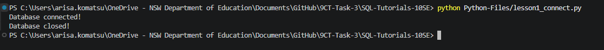

# Lesson 01 Evidence Pro-Forma

## Commit evidence (minimum 2)
- Commit 1 hash + message:
- Commit 2 hash + message:
- Optional Commit 3 hash + message:

## Run evidence
- Command run (example: `python lesson1_connect.py`):
- Terminal output pasted below:

## What I changed from the starter example
- Added a print statement before the connection was opened confirming that the system will commence attempting to open a connection.
- Changed the database name to "library.db" instead of "school.db"

## Error and fix
- Error I hit: File lesson1_connect.py not found by terminal
- How I fixed it: Figured out I was referring to the folder wrong because I said "./blahblah/blah.png" but apparently you don't need the "./"

## Understanding check (answer in your own words)
1. What is the difference between Python and SQLite?
Python is a programming language that works with SQLite, which is a file-based database engine.
2. What file was created when the script ran?
school.db
3. What does the connection do?
It opens a connection to a database, which is added to the repository.

## Quality checklist
- [ ] Script runs without unhandled errors
- [ ] I included at least 2 lesson commits
- [ ] I included terminal evidence
- [ ] I answered all questions in my own words
